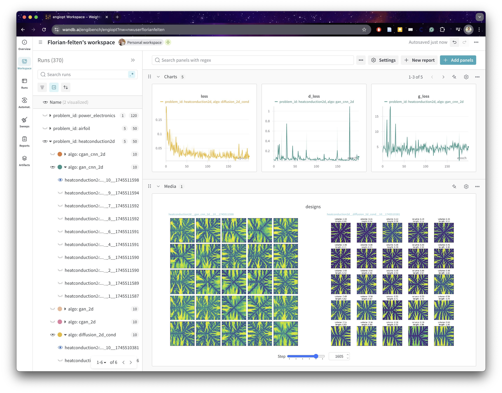

[](https://pre-commit.com/)
[](
    https://github.com/astral-sh/ruff)
[](http://mypy-lang.org/)

# EngiOpt

This repository contains the code for optimization and machine learning algorithms for engineering design problems. Our goal here is to provide clean example usage of [EngiBench](https://github.com/IDEALLab/EngiBench) and provide strong baselines for future comparisons.

## Coding Philosophy
As much as we can, we follow the [CleanRL](https://github.com/vwxyzjn/cleanrl) philosophy: single-file, high-quality implementations with research-friendly features:
* Single-file implementation: every training detail is in one file, so you can easily understand and modify the code. There is usually another file that contains evaluation code.
* High-quality: we use type hints, docstrings, and comments to make the code easy to understand. We also rely on linters for formatting and checking our code.
* Logging: we use experiment tracking tools like [Weights & Biases](https://wandb.ai/site) to log the results of our experiments. All our "official" runs are logged in the [EngiOpt project](https://wandb.ai/engibench/engiopt).
* Reproducibility: we seed all the random number generators, make PyTorch deterministic, report the hyperparameters and code in WandB.

## Install
Install EngiOpt dependencies:
```
cd EngiOpt/
pip install -e .
```

You might want to install a specific PyTorch version, e.g., with CUDA on top of it, see [PyTorch install](https://pytorch.org/get-started/locally/).

If you're modifying EngiBench, you can install it from source and as editable:
```
git clone git@github.com:IDEALLab/EngiBench.git
cd EngiBench/
pip install -e ".[all]"
```

## Dashboards
The integration with WandB allows us to access live dashboards of our runs (on the cluster or not). We also upload the trained models there. You can access some of our runs at https://wandb.ai/engibench/engiopt.


## Colab notebooks
We have some colab notebooks that show how to use some of the EngiBench/EngiOpt features.
* [Example hard model](https://colab.research.google.com/github/IDEALLab/EngiOpt/blob/main/example_hard_model.ipynb)
